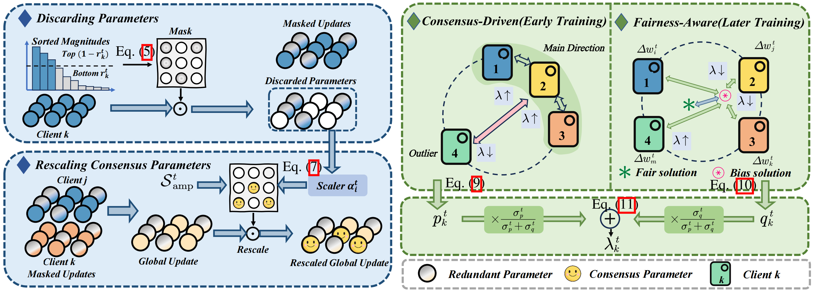

<link rel="stylesheet" href="../assets/css/about.css">








My name is Kaiqi Guan (官恺祺), I'm currently a undergraduate student at the [School of Computer Science](https://cs.whu.edu.cn/), [Wuhan University](https://www.whu.edu.cn/), fortunately supervised by [Prof. Mang Ye](https://marswhu.github.io/index.html) and [Mr. Wenke Huang](https://scholar.google.com/citations?hl=zh-CN&user=aFoCI3MAAAAJ).

# 📃 Publications

&dagger;: equal contribution, *: corresponding author

<dl>
  <dt></dt>
  <dd><a href="" class="publication-title">Rethinking Fair Federated Learning from Parameter and Client View</a></dd>
  <dd><strong>Kaiqi Guan&dagger;</strong>, Wenke Huang&dagger;, Xianda Guo, Yueyang Yuan, Bin Yang, Mang Ye*</dd>
  <dd>Annual Conference on Neural Information Processing Systems <strong>(NeurIPS)</strong>, 2025</dd>
  <dd><a href="https://github.com/guankaiqi/FedPW">[Project Page]</a></dd>
</dl>

# 🎖 Honors and Awards
- *2025.09* **National Scholarship** **(<u style="color: red;">Twice</u>)** (**<u>国家奖学金</u>**) (Award Rate: <strong>0.4% nation-wide</strong>) *Ministry of Education, China* 
- *2024.09* **National Scholarship** (**<u>国家奖学金</u>**) (Award Rate: <strong>0.4% nation-wide</strong>) *Ministry of Education, China* 

# 📖 Educations
- *2023.09 - Now*, School of Computer Science, Wuhan University